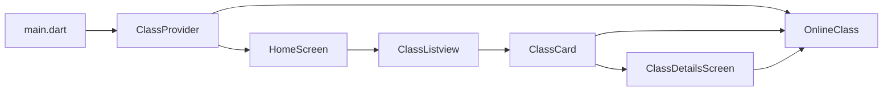

# Mentorly

Mentorly is a Flutter mobile app for browsing and managing online learning classes. The current implementation is a UI-first prototype with mock class data, a tabbed home experience, and a detail screen for each class. The structure is intentionally simple so a new developer can understand the app quickly and extend it toward real APIs, authentication, and live class features.

## Overview

The app currently provides:

- A home screen with three tabs: Live, Upcoming, and Completed
- A card-based class list for each category
- A class details screen when a card is tapped
- A lightweight state layer powered by Provider and ChangeNotifier
- A central theme and reusable style constants for consistent UI

This README focuses on architecture, technology choices, and code organization rather than setup steps.

## Tech Stack

- Flutter + Dart
  - SDK constraint: ^3.12.1 in [pubspec.yaml](pubspec.yaml)
  - Uses Material 3 styling and Flutter widgets for cross-platform UI
- State management
  - Provider with ChangeNotifier for simple, readable app state
- UI and styling
  - Material widgets
  - Google Fonts for typography
  - Cupertino icons for platform-consistent iconography
- Data formatting
  - intl for date and time formatting
- Real-time / video integration placeholders
  - zego_uikit_prebuilt_video_conference
  - zego_express_engine
  - These are included as the natural starting point for future live-class experiences
- Quality and testing
  - flutter_test for widget/unit tests
  - flutter_lints and analyzer rules in [analysis_options.yaml](analysis_options.yaml)
- Platform support
  - Android build configuration under [android](android)
  - iOS build configuration under [ios](ios)

## Architecture

Mentorly follows a small layered architecture that keeps responsibilities separated without introducing unnecessary complexity.

### 1. Presentation Layer

Located in [lib/screens](lib/screens) and [lib/widgets](lib/widgets).

- [lib/screens/home_screen.dart](lib/screens/home_screen.dart) renders the tabbed home experience and listens to the provider
- [lib/screens/class_details_screen.dart](lib/screens/class_details_screen.dart) displays class metadata in a detail view
- [lib/widgets/class_card.dart](lib/widgets/class_card.dart) renders each course card and handles navigation to details
- [lib/widgets/class_listview.dart](lib/widgets/class_listview.dart) renders the list for each tab and shows empty states

### 2. State Layer

Located in [lib/providers](lib/providers).

- [lib/providers/class_provider.dart](lib/providers/class_provider.dart) owns the app’s class data and exposes computed lists for live, upcoming, and completed courses
- It is the main place for filtering logic, refresh behavior, and any future business rules
- Because the app is still data-light, the provider currently seeds the data directly; this is the ideal place to later delegate to a service or repository layer

### 3. Domain Layer

Located in [lib/models](lib/models).

- [lib/models/online_class.dart](lib/models/online_class.dart) defines the core domain object for a class
- The model contains the class properties and computed helpers such as isLive, isUpcoming, and isCompleted
- This layer should stay focused on data shape and domain rules rather than UI behavior

### 4. Shared / Support Layer

Located in [lib/theme](lib/theme) and [lib/utils](lib/utils).

- [lib/theme/app_theme.dart](lib/theme/app_theme.dart) centralizes color and theme configuration
- [lib/utils/constants.dart](lib/utils/constants.dart) stores reusable constants and current Zego placeholder values

### 5. Platform Layer

- [android](android) contains native Android project files and Gradle settings
- [ios](ios) contains native iOS project files and Xcode configuration

## Runtime Flow

The current app flow is straightforward:

1. [lib/main.dart](lib/main.dart) boots the app and creates a ChangeNotifier provider for the class state.
2. [lib/screens/home_screen.dart](lib/screens/home_screen.dart) consumes that provider and displays three categorized lists.
3. [lib/providers/class_provider.dart](lib/providers/class_provider.dart) supplies the data and calculates which classes belong in each tab.
4. [lib/widgets/class_card.dart](lib/widgets/class_card.dart) renders cards and navigates to [lib/screens/class_details_screen.dart](lib/screens/class_details_screen.dart).
5. [lib/models/online_class.dart](lib/models/online_class.dart) provides the underlying class data used throughout the UI.

A simple dependency flow is shown below:



## Project Structure

```text
mentorly/
├── android/                    # Native Android project files
├── ios/                        # Native iOS project files
├── lib/
│   ├── main.dart               # App bootstrap and top-level provider setup
│   ├── models/
│   │   └── online_class.dart   # Domain model for classes
│   ├── providers/
│   │   └── class_provider.dart # State and filtering logic for class lists
│   ├── screens/
│   │   ├── home_screen.dart    # Main tabbed screen
│   │   └── class_details_screen.dart # Class detail view
│   ├── widgets/
│   │   ├── class_card.dart     # Single class card UI
│   │   └── class_listview.dart # List container with empty state
│   ├── theme/
│   │   └── app_theme.dart      # Shared theme values and subject colors
│   └── utils/
│       └── constants.dart      # Shared constants and Zego placeholders
├── test/                       # Unit and widget tests
├── pubspec.yaml                # Dependencies and SDK constraints
└── analysis_options.yaml       # Lint and analyzer rules
```

## How the Main Files Connect

- [lib/main.dart](lib/main.dart)
  - Creates the app root
  - Wires the provider into the widget tree
  - Sets the app theme and initial home screen

- [lib/providers/class_provider.dart](lib/providers/class_provider.dart)
  - Holds the list of classes
  - Exposes category-based getters for live, upcoming, and completed classes
  - Supplies refresh behavior and acts as the main state owner

- [lib/screens/home_screen.dart](lib/screens/home_screen.dart)
  - Displays the tab bar and content area
  - Reads the provider through context.watch
  - Passes category data into the list widget

- [lib/widgets/class_listview.dart](lib/widgets/class_listview.dart)
  - Accepts a set of classes and type information
  - Renders either list content or an empty state

- [lib/widgets/class_card.dart](lib/widgets/class_card.dart)
  - Represents one class in a card UI
  - Handles the tap action and navigation to the details screen

- [lib/screens/class_details_screen.dart](lib/screens/class_details_screen.dart)
  - Displays a richer detail view for a selected class
  - Uses the shared theme colors and date formatting

- [lib/models/online_class.dart](lib/models/online_class.dart)
  - Defines the core model used by provider, cards, and details screen
  - Contains the logic that determines whether a class is live, upcoming, or completed

- [lib/theme/app_theme.dart](lib/theme/app_theme.dart) and [lib/utils/constants.dart](lib/utils/constants.dart)
  - Keep styling and reusable values centralized
  - Avoid scattering visual decisions or feature constants across the UI layer

## Extension Points for Future Development

The current app is intentionally simple, and the codebase is already structured to grow cleanly.

Recommended next layers:

- A services layer for network/API access
- A repository layer to abstract data sources
- A routing layer for a more scalable navigation structure
- A real-time/video layer that uses the existing Zego dependencies

## Development Guidelines

- Keep UI logic in [lib/screens](lib/screens) and [lib/widgets](lib/widgets)
- Keep state and business rules in [lib/providers](lib/providers)
- Keep domain data and behavior in [lib/models](lib/models)
- Centralize colors, fonts, and shared configuration in [lib/theme](lib/theme) and [lib/utils](lib/utils)
- Add tests in [test](test) for providers and key UI behaviors as the app grows

## Notes for the Next Developer

If you are modifying the app, start by understanding this path:

1. Data and rules live in [lib/models/online_class.dart](lib/models/online_class.dart)
2. State and filtering live in [lib/providers/class_provider.dart](lib/providers/class_provider.dart)
3. Screen composition lives in [lib/screens/home_screen.dart](lib/screens/home_screen.dart)
4. Reusable presentation lives in [lib/widgets](lib/widgets)
5. Visual style and shared constants live in [lib/theme/app_theme.dart](lib/theme/app_theme.dart) and [lib/utils/constants.dart](lib/utils/constants.dart)
